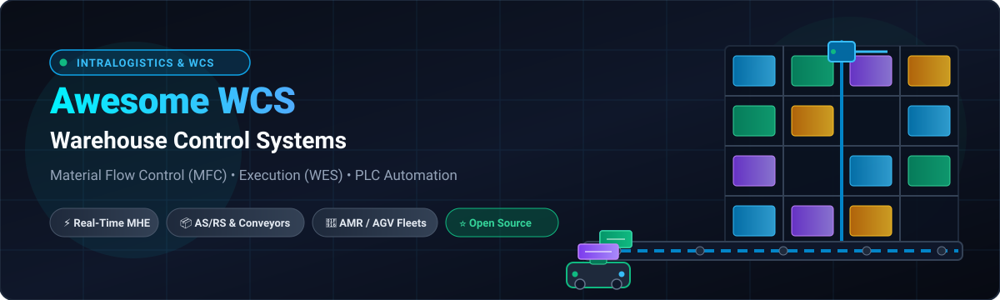

<div align="center">



# 🏭 Awesome Warehouse Control System (WCS) & Intralogistics

#### 🚀 Curated Guide to Commercial SaaS Platforms, Open-Source WCS/MFC Projects, WES Orchestration, Industrial IoT & PLC Automation

<p align="center">
  <a href="https://github.com/ishandutta2007/Awesome-Awesome-Awesome"></a><a href="https://discord.gg/jc4xtF58Ve"></a>
  <a href="https://github.com/ishandutta2007/Awesome-Warehouse-Control-System/stargazers"></a>
  <a href="https://github.com/ishandutta2007/Awesome-Warehouse-Control-System/network/members"></a>
  <a href="https://github.com/ishandutta2007/Awesome-Warehouse-Control-System/blob/main/LICENSE"></a>
  <a href="https://github.com/ishandutta2007"></a>
</p>

---

**Keywords / SEO**: *Warehouse Control System (WCS), Material Flow Control (MFC), Warehouse Execution System (WES), Intralogistics, Automated Storage and Retrieval System (AS/RS), AGV / AMR Fleet Management, Conveyor Routing, Sortation Systems, Industrial Automation, PLC, OPC UA, Modbus, Supply Chain Logistics.*

---

</div>

## 📖 Overview

A **Warehouse Control System (WCS)** acts as the real-time nervous system of automated facilities, positioned directly between the **WMS / ERP layer** and **physical industrial automation**. It orchestrates material-handling equipment (MHE) including conveyors, sorters, AS/RS cranes, shuttles, AMRs/AGVs, robotic picking arms, palletizers, and PLC controllers.

This curated list features enterprise **Commercial SaaS / Hosted Platforms** ranked by company valuation & revenue, alongside a sorted catalog of **Open-Source GitHub Projects** and automation building blocks with real-time star metrics.

---

## 📑 Table of Contents

* [🏢 Commercial & SaaS Platforms (Ranked by Valuation / Revenue)](#-commercial--saas-platforms)
* [⭐ Open-Source WCS, MFC & WES Projects](#-open-source-wcs-mfc--wes-projects)
* [🤖 Robotics, AMR Fleet Management & Simulation](#-robotics-amr-fleet-management--simulation)
* [⚡ Industrial Control, PLC & Communication Layer](#-industrial-control-plc--communication-layer)
* [📊 Data, Event Streaming, Observability & Workflow](#-data-event-streaming-observability--workflow)
* [🏗️ Recommended Open-Source WCS Architecture Stack](#️-recommended-open-source-wcs-architecture-stack)
* [⭐ Star History](#-star-history)
* [🤝 How to Contribute](#-how-to-contribute)
* [⚖️ Disclaimer](#️-disclaimer)

---

## 🏢 Commercial & SaaS Platforms

*Sorted in **descending order** by company scale (Market Capitalization / Enterprise Valuation / Annual Revenue).*

| 🏢 Platform / Product | 💼 Company Size (Valuation / Revenue) | 🛠️ Capabilities & Focus | 💰 Pricing (Starting Tier) | 🎁 Free Tier / Free Trial Limits |
| :--- | :--- | :--- | :--- | :--- |
| **[Oracle Warehouse Management](https://www.oracle.com/scm/logistics/warehouse-management/)** | **~$420B Market Cap**<br>*(~$53B Annual Revenue)* | Comprehensive cloud WMS (formerly LogFire) providing real-time automation integration, inventory tracking, task dispatching, and MHE interfacing. | Starts at **$125/user/month** (or entry cloud subscription starting at **$2,083/month** / $25,000/year base). | **30-day trial with $300 Oracle Cloud free credits** to spin up and test Oracle WMS Cloud sandboxes and APIs (no perpetual free tier). |
| **[SAP Extended Warehouse Management](https://www.sap.com/products/scm/extended-warehouse-management.html)** | **~$275B Market Cap**<br>*(~$35B Annual Revenue)* | Enterprise WMS/MFS platform with Material Flow System (MFS) capability to connect directly to PLCs, automated conveyors, and AS/RS without standalone WCS. | Basic EWM included in SAP S/4HANA (from **$1,000/month** ERP entry); Advanced EWM add-on starts at **$116/user/month** (or starting at **$5,000/month** base). | **30-day free trial** via SAP S/4HANA Cloud / SAP Discovery Center (includes preloaded best-practice warehouse data and 1 sandbox tenant; no perpetual free tier). |
| **[Swisslog SynQ](https://www.swisslog.com/en-us/products-systems-solutions/software-inventory-management/synq-warehouse-management-system-wms-mfcs)** | **~$65B Group Market Cap**<br>*(Midea/KUKA Group; Swisslog ~$1.0B Revenue)* | Intelligent intralogistics platform combining WMS, WCS, and Material Flow Control (MFC) to orchestrate automated warehouses, AS/RS, AutoStore, CycloneCarrier, and robotic picking. | Starts at **$2,500/month** (~$30,000/year) for entry-tier base MFC/WCS module and single automated zone orchestration. | **30-day guided POC sandbox** trial with simulated MHE device telemetry and sample warehouse layout (no permanent free tier). |
| **[Blue Yonder Warehouse Management](https://blueyonder.com/)** | **~$28B Parent Market Cap**<br>*(Panasonic; ~$8.5B Blue Yonder Valuation / ~$1.3B Revenue)* | Enterprise fulfillment and warehouse management platform featuring automation integration, real-time task orchestration, and robotics integration. | Starts at **$6,666/month** (~$80,000/year) per site for baseline cloud tier. | **30-day guided Proof-of-Value (POV)** sandbox environment with sample fulfillment workflows and up to 10 test operator profiles (no perpetual free tier). |
| **[Manhattan Active Warehouse Management](https://www.manh.com/)** | **~$16.5B Market Cap**<br>*(~$1.0B Annual Revenue)* | Cloud-native, microservices-based enterprise WMS/WES combining order streaming, real-time robotics orchestration, and dynamic task management. | Starts at **$166/user/month** ($2,000/user/year) with entry cloud deployment tier starting at **$10,000/month** (~$120,000/year). | **30-day cloud test tenant** for qualified enterprise evaluations (includes preconfigured sandbox, 5 user accounts, and API sandbox access; no perpetual free tier). |
| **[Dematic iQ / Dematic WCS](https://www.dematic.com/)** | **~$6.5B Parent Market Cap**<br>*(KION Group ~$12.5B Revenue; Dematic ~$4.0B)* | Enterprise warehouse software ecosystem covering WCS, WES, and WMS for real-time equipment routing, Multishuttle systems, conveyor control, and high-speed sortation. | Starts at **$4,166/month** (~$50,000/year) for base WCS equipment interface and core material flow routing module. | **30-day structured pilot sandbox** with virtual warehouse emulation, simulated conveyor loops, and throughput stress testing (no perpetual free tier). |
| **[Daifuku](https://www.daifuku.com/)** | **~$7.5B Market Cap**<br>*(~$4.2B Annual Revenue)* | Integrated intralogistics and material-handling control software managing AS/RS stacker cranes, conveyor networks, sortation systems, and automated vehicle fleets. | Starts at **$8,000/month** (~$96,000/year) for base controller software package and standard equipment integration tier. | **30-day pre-commissioning simulation environment** with virtual PLC controllers and up to 10 automated device mappings (no perpetual free tier). |
| **[Körber WCS / K.OneX](https://www.koerber.com/)** | **~$4.5B Enterprise Valuation**<br>*(~$3.2B Annual Revenue)* | Vendor-agnostic warehouse control suite designed to orchestrate heterogeneous MHE, AMR/AGV fleets, AS/RS, and automated goods-to-person workflows with modular SAP integration. | Starts at **$5,000/month** (~$60,000/year) for K.OneX / K.Motion WCS base license tier. | **30-day Proof-of-Value (POV) trial** including cloud simulation tenant, sample workflow templates, and up to 5 simulated PLC/device endpoints (no perpetual free tier). |
| **[SSI SCHAEFER WAMAS](https://www.ssi-schaefer.com/)** | **~$2.2B Annual Revenue**<br>*(Private Enterprise)* | Modular logistics software suite connecting WMS, material flow control (MFC/WCS), and machine control systems (PLC) with real-time 3D visualization. | Starts at **$3,500/month** (~$42,000/year) for base WAMAS MCS/WCS instance license. | **30-day virtual commissioning test period** using WAMAS 3D Digital Twin simulation with simulated transport orders (no perpetual free tier). |
| **[KNAPP KiSoft](https://www.knapp.com/)** | **~$2.1B Annual Revenue**<br>*(Private Enterprise)* | Modular intralogistics software suite covering WMS, WCS, and MFC machine-control communication for shuttles, OSR Shuttle Evo, and automated picking robots. | Starts at **$4,500/month** (~$54,000/year) for entry KiSoft WCS/MFC software subscription. | **30-day guided sandbox access** with virtual emulation environment, up to 3 test workstations, and sample SKU databases (no perpetual free tier). |
| **[FORTNA](https://www.fortna.com/)** | **~$1.8B Valuation**<br>*(~$850M+ Annual Revenue)* | Enterprise Warehouse Execution (FORTNA WES) and Control software for real-time dynamic resource allocation, automated picking, and multi-vendor MHE orchestration. | Starts at **$6,250/month** (~$75,000/year) for base WES orchestration module. | **30-day guided interactive emulation trial** with digital twin facility modeling and workflow optimization analysis (no perpetual free tier). |
| **[Mecalux Easy WMS](https://www.mecalux.com/software/easy-wms)** | **~$1.6B Valuation**<br>*(~$950M Annual Revenue)* | Warehouse management and automation control software managing manual, semi-automated, and fully automated storage systems with integrated WCS/MFS modules. | Starts at **$500/month** (~$6,000/year) for SaaS entry Pro tier (or ~$1,200/month for automated MHE-integrated tier). | **14-day interactive cloud demo sandbox** with preloaded test catalog, 1 simulated warehouse zone, and up to 1,000 test transactions (no perpetual free tier). |
| **[WITRON](https://www.witron.com/)** | **~$1.4B Annual Revenue**<br>*(Private Enterprise)* | End-to-end proprietary warehouse automation and MFC software optimizing high-throughput order picking (OPM), dynamic AS/RS, and automated distribution center logistics. | Starts at **$10,000/month** (~$120,000/year) for base MFC and software controller module layer in modular enterprise deployments. | **30-day design & simulation evaluation** (digital twin throughput modeling and material-flow stress testing during engineering scoping; no perpetual free tier). |
| **[Made4net WCS / SCExpert](https://made4net.com/platform/)** | **~$280M Valuation**<br>*(~$50M Annual Revenue)* | Rules-based, highly configurable WMS/WCS/WES platform with native real-time control of automated conveyors, AS/RS, shuttles, AGVs, and robotic sorting systems. | Starts at **$500/month** (~$6,000/year) for entry cloud tier (or ~$1,000/month with automation MHE add-on). | **14-day cloud sandbox trial** with full feature access, 1 test facility, up to 5 user logins, and 500 test SKU/order records (no perpetual free tier). |

---

## ⭐ Open-Source WCS, MFC & WES Projects

*Sorted in **descending order** by GitHub Star count.*

* **[ERPNext](https://github.com/frappe/erpnext)** [](https://github.com/frappe/erpnext/stargazers)
  📦 **ERP / Warehouse Management Foundation**
  Comprehensive open-source ERP platform featuring full inventory, multi-warehouse stock management, pick lists, serial/batch tracking, and supply-chain logistics. Serves as a modular inventory layer feeding automated WCS/MFC engines.

* **[ModernWMS](https://github.com/fjykTec/ModernWMS)** [](https://github.com/fjykTec/ModernWMS/stargazers)
  📦 **Modern Open-Source WMS**
  Cross-platform warehouse management system covering inbound receiving, automated dispatch, put-away, wave picking, and inventory movements with a modern UI and REST APIs for automation interfacing.

* **[OpenBoxes](https://github.com/openboxes/openboxes)** [](https://github.com/openboxes/openboxes/stargazers)
  📦 **Supply Chain & Inventory Foundation**
  Open-source supply chain and inventory management platform designed to manage receiving, tracking, stock relocations, and shipping across multi-echelon warehouse networks.

* **[openWCS](https://github.com/openwcs)** [](https://github.com/openwcs/openwcs/stargazers)
  ⚡ **Direct WCS — Premier Open-Source WCS Candidate**
  Vendor-neutral Warehouse Control System built to orchestrate conveyors, AS/RS, AMRs, and AutoStore grids. Features dynamic transport routing, allocation engines, goods-to-person station management, equipment adapters, and a real-time 3D warehouse digital twin.

* **[OpenWMS.org](https://github.com/openwms/org.openwms)** [](https://github.com/openwms/org.openwms/stargazers)
  ⚡ **Direct WMS + Material Flow Control (MFC)**
  Microservice-based warehouse management and Material Flow Control platform supporting automated and semi-automated intralogistics, pallet tracking, conveyor routing, and telegram interfaces.

* **[Great Blue / Open WMS](https://github.com/infiniteoo/wms)** [](https://github.com/infiniteoo/wms/stargazers)
  📦 **Full-Stack TypeScript WMS**
  Modern warehouse management platform built with Next.js, React Native, and PostgreSQL. Ideal as an open upstream inventory and order dispatching layer.

* **[Open WES](https://github.com/jingsewu/open-wes)** [](https://github.com/jingsewu/open-wes/stargazers)
  🔄 **Warehouse Execution System (WES)**
  Configurable open-source Warehouse Execution System with dynamic task dispatching, real-time monitoring, business rule orchestration, and equipment control bridges.

* **[Sentry WMS](https://github.com/hightower-systems/sentry-wms)** [](https://github.com/hightower-systems/sentry-wms/stargazers)
  📦 **Barcode-Driven Inventory System**
  Focused on high-velocity barcode scanning, put-away validation, cycle counting, and real-time inventory synchronization.

* **[WarehouseControlSystem](https://github.com/OlegLobakov/WarehouseControlSystem)** [](https://github.com/OlegLobakov/WarehouseControlSystem/stargazers)
  ⚡ **Direct WCS Reference Implementation**
  Lightweight WCS implementation interfacing with ERPs (Microsoft Dynamics NAV) for conveyor zone management and automated transport tasks.

* **[OpenWMS TMS Routing](https://github.com/openwms/org.openwms.tms.routing)** [](https://github.com/openwms/org.openwms.tms.routing/stargazers)
  ⚡ **Direct MFC / Transport Routing Engine**
  Specialized transport unit routing service for conveyor networks, selecting optimal paths, managing segment allocations, and exchanging telegrams with PLCs.

---

## 🤖 Robotics, AMR Fleet Management & Simulation

*Sorted in **descending order** by GitHub Star count.*

* **[Gazebo Simulator](https://github.com/gazebosim/gz-sim)** [](https://github.com/gazebosim/gz-sim/stargazers)
  🌐 **High-Fidelity Physics & Warehouse Simulation**
  Industrial-grade robotics and sensor simulation environment used to test conveyor flows, AS/RS mechanisms, AGVs, and mobile robots before physical commissioning.

* **[Open-RMF (Robotics Middleware Framework)](https://github.com/open-rmf/rmf)** [](https://github.com/open-rmf/rmf/stargazers)
  🤖 **Heterogeneous AMR/AGV Fleet Orchestration**
  Standardized framework for coordinating multi-vendor fleets of automated guided vehicles, mobile robots, automated doors, lifts, and warehouse traffic management.

* **[Universal Robots ROS2 Driver](https://github.com/Universal-Robots/Universal_Robots_ROS2_Driver)** [](https://github.com/Universal-Robots/Universal_Robots_ROS2_Driver/stargazers)
  🦾 **Robotic Arm & Palletizing Control**
  Production-ready ROS2 driver enabling WCS integration with articulated robotic arms for goods-to-person picking, depalletizing, and automated sorting.

---

## ⚡ Industrial Control, PLC & Communication Layer

*Sorted in **descending order** by GitHub Star count.*

* **[asyncua / python-opcua](https://github.com/FreeOpcUa/opcua-asyncio)** [](https://github.com/FreeOpcUa/opcua-asyncio/stargazers)
  🔌 **Asynchronous OPC UA Stack (Python)**
  High-performance OPC UA client and server library in pure Python. Essential for building real-time WCS adapters communicating with industrial PLCs and SCADA nodes.

* **[OpenPLC](https://github.com/thiagoralves/OpenPLC_v3)** [](https://github.com/thiagoralves/OpenPLC_v3/stargazers)
  🎛️ **IEC 61131-3 Industrial PLC Runtime**
  Multi-platform open-source PLC runtime supporting Ladder Logic, Structured Text, and Modbus/EtherNet/IP for conveyor loops and machine actuation.

* **[Apache PLC4X](https://github.com/apache/plc4x)** [](https://github.com/apache/plc4x/stargazers)
  🔌 **Universal PLC Protocol Adapter Library**
  Unified API communicating with Siemens S7, Rockwell EtherNet/IP, Modbus, Beckhoff ADS, and Omron Fins without requiring proprietary vendor drivers.

* **[Eclipse Milo](https://github.com/eclipse-milo/milo)** [](https://github.com/eclipse-milo/milo/stargazers)
  🔌 **Production Java OPC UA Stack**
  Enterprise-ready Java implementation of OPC UA (Client and Server) used extensively in industrial Java-based WCS/MFC applications.

* **[Eclipse 4diac](https://github.com/eclipse-4diac/4diac-ide)** [](https://github.com/eclipse-4diac/4diac-ide/stargazers)
  🎛️ **Distributed Industrial Automation (IEC 61499)**
  Framework for distributed automation systems, enabling event-driven control logic across networked warehouse controllers and sensors.

---

## 📊 Data, Event Streaming, Observability & Workflow

*Sorted in **descending order** by GitHub Star count.*

* **[Grafana](https://github.com/grafana/grafana)** [](https://github.com/grafana/grafana/stargazers)
  📈 **Operational Dashboards & Intralogistics Analytics**
  Observability platform for tracking equipment availability, conveyor throughput, OEE, alarm frequencies, MTBF/MTTR, and pick rates.

* **[Apache Kafka](https://github.com/apache/kafka)** [](https://github.com/apache/kafka/stargazers)
  ⚡ **Distributed Event Streaming Backbone**
  High-throughput messaging backbone connecting WMS, WES, and WCS microservices, handling real-time transport orders and telemetry.

* **[InfluxDB](https://github.com/influxdata/influxdb)** [](https://github.com/influxdata/influxdb/stargazers)
  ⏱️ **Time-Series Telemetry Engine**
  Time-series database optimized for logging motor temperatures, sensor states, conveyor speeds, cycle times, and PLC diagnostic metrics.

* **[Node-RED](https://github.com/node-red/node-red)** [](https://github.com/node-red/node-red/stargazers)
  🔀 **Flow-Based Low-Code Integration Gateway**
  Visual programming tool connecting MQTT brokers, REST APIs, barcodes, and PLC protocols for rapid integration and protocol transformation.

* **[ThingsBoard](https://github.com/thingsboard/thingsboard)** [](https://github.com/thingsboard/thingsboard/stargazers)
  📡 **Industrial IoT & Device Management**
  Scalable IoT platform for sensor fleet monitoring, telemetry analysis, alarm triggers, and visual device twins.

* **[Flowable](https://github.com/flowable/flowable-engine)** [](https://github.com/flowable/flowable-engine/stargazers)
  ⚙️ **BPMN Workflow & Exception Engine**
  Lightweight BPMN/CMMN engine for modeling warehouse execution flows, picking logic, replenishment triggers, and automated exception routing.

* **[Camunda](https://github.com/camunda/camunda)** [](https://github.com/camunda/camunda/stargazers)
  ⚙️ **Process Orchestration Platform**
  Orchestration platform for complex end-to-end supply-chain processes, human task routing, and automated fulfillment workflows.

---

## 🏗️ Recommended Open-Source WCS Architecture Stack

Build a **vendor-neutral, highly modular, and open-source intralogistics stack** to avoid single-vendor lock-in:

```
┌─────────────────────────────────────────────────────────────┐
│                    🏢 WMS / ERP Layer                       │
│             ERPNext  /  OpenBoxes  /  ModernWMS             │
└──────────────────────────────┬──────────────────────────────┘
                               │  (REST / GraphQL / Kafka)
                               ▼
┌─────────────────────────────────────────────────────────────┐
│             🔄 WES / Workflow Orchestration                 │
│              Open WES  /  Flowable  /  Camunda              │
└──────────────────────────────┬──────────────────────────────┘
                               │  (JSON / gRPC / Events)
                               ▼
┌─────────────────────────────────────────────────────────────┐
│          ⚡ WCS / Material Flow Control (MFC)               │
│              openWCS  /  OpenWMS MFC & Routing              │
└──────────────────────────────┬──────────────────────────────┘
                               │  (Event Mesh / MQTT)
                               ▼
┌─────────────────────────────────────────────────────────────┐
│             📡 Integration & Middleware Layer               │
│               Apache Kafka  /  Node-RED  /  MQTT            │
└──────────────────────────────┬──────────────────────────────┘
                               │  (OPC UA / Modbus / TCP)
                               ▼
┌─────────────────────────────────────────────────────────────┐
│         🔌 Industrial Communication & Robot Bridges         │
│     Apache PLC4X  /  asyncua  /  Milo  /  Open-RMF (AMRs)   │
└──────────────────────────────┬──────────────────────────────┘
                               │  (Fieldbus / Profinet / EtherCAT)
                               ▼
┌─────────────────────────────────────────────────────────────┐
│              🎛️ PLC & Machine Control Layer                 │
│             OpenPLC  /  Eclipse 4diac  /  PLCs              │
└──────────────────────────────┬──────────────────────────────┘
                               │  (I/O Signals / Actuation)
                               ▼
┌─────────────────────────────────────────────────────────────┐
│                 📦 Physical Automation MHE                  │
│ Conveyors • Sorters • AS/RS • Shuttles • AMRs/AGVs • Robots │
└─────────────────────────────────────────────────────────────┘
                               ▲
                               │  (Telemetry & Status)
┌──────────────────────────────┴──────────────────────────────┐
│           📊 Observability, Metrics & Digital Twin          │
│          Grafana  +  InfluxDB  +  ThingsBoard  +  Gazebo    │
└─────────────────────────────────────────────────────────────┘
```

---

## ⭐ Star History

[](https://star-history.dera.page/#ishandutta2007/Awesome-Warehouse-Control-System&type=date&legend=top-left)

---

## 🤝 How to Contribute

1. 🍴 Fork the repository.
2. 📝 Add or update entries in `README.md` keeping the established markdown format.
3. 🔗 Include: project/platform name, official link, stargazers star badge (for open source), concise capability overview, pricing tier, and free trial terms.
4. ⭐ Categorize clearly as **WCS/MFC**, **WES/WMS**, **AMR/Robotics**, or **Industrial Control Building Block**.
5. 🚀 Submit a Pull Request with a clear description of your additions.

---

## ⚖️ Disclaimer

* This is a **community-curated** list — not exhaustive and not a commercial endorsement.
* Commercial warehouse-control platforms are often sold and deployed alongside complete engineering and material handling projects.
* Open-source software must be paired with industrial-grade safety systems, certified emergency-stop circuits (PL-d/SIL-2+), network segmentation, and thorough fail-safe validation before driving physical warehouse machinery.
* Always review project licenses, security patches, and protocol compatibility before deploying into production environments.

---

<div align="center">
  <sub>Made with ❤️ for warehouse operators, automation engineers, roboticists, integrators, and software developers building open intralogistics platforms.</sub>
</div>